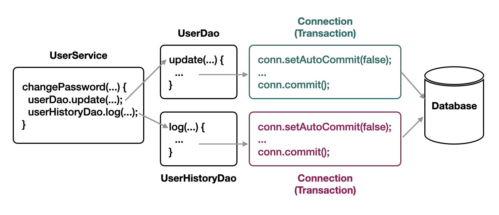

# 만들면서 배우는 스프링
[Next Step - 과정 소개](https://edu.nextstep.camp/c/4YUvqn9V)

## JDBC 라이브러리 구현하기

### 학습목표
- JDBC 라이브러리를 구현하는 경험을 함으로써 중복을 제거하는 연습을 한다.
- Transaction 적용을 위해 알아야할 개념을 이해한다.

### 시작 가이드
1. 이전 미션에서 진행한 코드를 사용하고 싶다면, 마이그레이션 작업을 진행합니다.
    - 학습 테스트는 강의 시간에 풀어봅시다.
2. LMS의 1단계 미션부터 진행합니다.

## 준비 사항
- 강의 시작 전에 docker를 설치해주세요.

## 학습 테스트
1. [ConnectionPool](study/src/test/java/connectionpool)
2. [Transaction](study/src/test/java/transaction)

## 요구사항 정리
### 🚀 1단계 - JDBC 라이브러리 구현하기
- [x] SQL 쿼리 작성, 쿼리에 전달할 인자, Select 구문일 경우 조회 결과를 추출하는 것만 집중할 수 있어야 한다.
  - [x] 쿼리만 작성해서 jdbcTemplate에 넘기도록 구성한다
  - [x] 쿼리에 전달할 인자를 함께 넘기도록 구성한다 
  - [x] select 구문일 경우 조회 결과를 추출할 수 있어야 한다

### 🚀 2단계 - 리팩터링
- 아래의 동작을 라이브러리로 만든다 
  - [x] Connection 생성 
  - [x] Statement 준비 및 실행 
  - [x] ResultSet 생성 
  - [x] 예외 처리 
  - [x] 트랜잭션 관리 
  - [x] Connection, Statement, ResultSet 객체 close

### 🚀 3단계 - Transaction 적용하기
- [] User의 비밀번호를 변경할 수 있는 기능 추가하기 
  - [] 비밀번호를 변경하면 변경 이력을 남긴다 (누가, 언제, 어떤 비밀번호로 바꿨는지)
- [] `changePassword()` 메서드가 원자성을 보장하도록 구현하기 
  - [] 메서드 수행 중간에 예외가 발생하여 작업 완료가 불가능해질 경우 롤백
    - [] 트랜잭션 경계 설정하기 
    - [] 개별적인 트랜잭션을 하나로 합치기 
      - as-is
        - 
      - to-be
        - UserDao와 UserHistoryDao가 하나의 트랜잭션을 이용해야 한다.
- [] `UserServiceTest` 테스트 통과하기